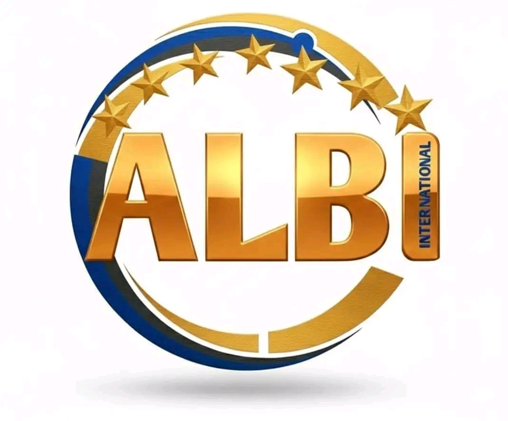

<div align="center">



# 🌿 Albi International

**Association de sensibilisation à l'environnement et à la solidarité humaine**

[](https://astro.build)
[](https://react.dev)
[](https://tailwindcss.com)
[](https://www.typescriptlang.org)
[](LICENSE)

[🌐 Site Web](#) · [📧 Contact](#contact) · [💚 Soutenir](#soutenir)

</div>

---

## 📖 À propos

**Albi International** est une association loi 1901 engagée dans la **protection de l'environnement**, la **sensibilisation écologique** et la **solidarité humaine**. Notre mission : fédérer citoyens, entreprises et institutions autour d'actions concrètes pour un avenir plus vert et plus juste.

### Nos piliers d'action
- 🌱 **Environnement** — Reboisement, nettoyage, biodiversité
- ☀️ **Santé publique** — Prévention et sensibilisation (ALBI)
- 🤝 **Solidarité** — Actions humanitaires et inclusion sociale
- 📚 **Éducation** — Sensibilisation des jeunes et des communautés

---

## 🚀 Stack Technique

| Technologie | Rôle |
|---|---|
| **[Astro](https://astro.build)** | Framework SSG (Static Site Generation) — SEO optimal |
| **[React 19](https://react.dev)** | Composants interactifs (îlots) |
| **[Tailwind CSS v4](https://tailwindcss.com)** | Styles utilitaires |
| **[Motion](https://motion.dev)** | Animations fluides |
| **[TypeScript](https://www.typescriptlang.org)** | Typage statique |

---

## 🛠️ Installation & Développement

### Prérequis
- [Node.js](https://nodejs.org) v18 ou supérieur
- npm v9 ou supérieur

### Lancer en local

```bash
# 1. Cloner le dépôt
git clone https://github.com/mawugnonhoungbedji-dot/albi.git
cd albi

# 2. Installer les dépendances
npm install

# 3. Copier les variables d'environnement
cp .env.example .env.local

# 4. Lancer le serveur de développement
npm run dev
```

Le site sera disponible sur **http://localhost:4321**

### Scripts disponibles

| Commande | Description |
|---|---|
| `npm run dev` | Serveur de développement avec hot-reload |
| `npm run build` | Build de production dans `dist/` |
| `npm run preview` | Prévisualiser le build de production |

---

## 🗂️ Structure du projet

```
albi/
├── src/
│   ├── assets/
│   │   └── images/         # Images du site
│   ├── components/         # Composants React réutilisables
│   │   ├── Header.tsx
│   │   ├── Hero.tsx
│   │   ├── Introduction.tsx
│   │   ├── Projects.tsx
│   │   ├── GallerySection.tsx
│   │   ├── GetInvolved.tsx
│   │   ├── SolidarityCarousel.tsx
│   │   ├── RunningBanner.tsx
│   │   ├── SeparatorCampaign.tsx
│   │   └── ContactModal.tsx
│   ├── layouts/
│   │   └── Layout.astro    # Layout principal (SEO, OG, JSON-LD)
│   ├── pages/              # Routes Astro (1 fichier = 1 URL)
│   │   ├── index.astro     # /
│   │   ├── histoire.astro  # /histoire
│   │   ├── actions.astro   # /actions
│   │   ├── sensibilisation.astro  # /sensibilisation
│   │   └── soutenir.astro  # /soutenir
│   ├── AppWrapper.tsx      # Gestionnaire de pages React
│   ├── data.ts             # Données centralisées
│   └── index.css           # Styles globaux
├── astro.config.mjs        # Configuration Astro
├── tailwind.config.mjs     # Configuration Tailwind (si présent)
├── tsconfig.json           # Configuration TypeScript
└── package.json
```

---

## 📄 Pages

| URL | Description |
|---|---|
| `/` | Accueil — Hero, Introduction, Projets |
| `/histoire` | Histoire & Valeurs de l'association |
| `/actions` | Nos actions et initiatives |
| `/sensibilisation` | Campagnes de sensibilisation ALBI |
| `/soutenir` | Faire un don, devenir bénévole |

---

## 🔍 SEO / AEO / GEO

Le site est optimisé pour une visibilité maximale :

- ✅ **Meta tags** complets (title, description, canonical)
- ✅ **Open Graph** pour les réseaux sociaux
- ✅ **Twitter Cards**
- ✅ **JSON-LD** (Schema.org `NGO` + `FAQPage`)
- ✅ **Sitemap** automatique via `@astrojs/sitemap`
- ✅ **Robots.txt**
- ✅ **HTML sémantique** et structure de titres correcte
- ✅ **Core Web Vitals** optimisés (SSG = 0 JS côté serveur)

---

## 🌍 Déploiement

Le site est un **site statique Astro** — déployable gratuitement sur :

| Plateforme | Commande build | Dossier de sortie |
|---|---|---|
| **Vercel** | `npm run build` | `dist/` |
| **Netlify** | `npm run build` | `dist/` |
| **Cloudflare Pages** | `npm run build` | `dist/` |
| **GitHub Pages** | `npm run build` | `dist/` |

---

## 🤝 Contribuer

Les contributions sont les bienvenues ! Pour contribuer :

1. Forkez le projet
2. Créez votre branche (`git checkout -b feature/ma-fonctionnalite`)
3. Committez vos changements (`git commit -m 'feat: ajout de ma fonctionnalité'`)
4. Poussez (`git push origin feature/ma-fonctionnalite`)
5. Ouvrez une Pull Request

---

## 📧 Contact

**Albi International**  
Pour toute question, utilisez le formulaire de contact sur le site ou ouvrez une [issue GitHub](https://github.com/mawugnonhoungbedji-dot/albi/issues).

---

<div align="center">

Fait avec 💚 pour la planète · **Albi International** © 2025

</div>
